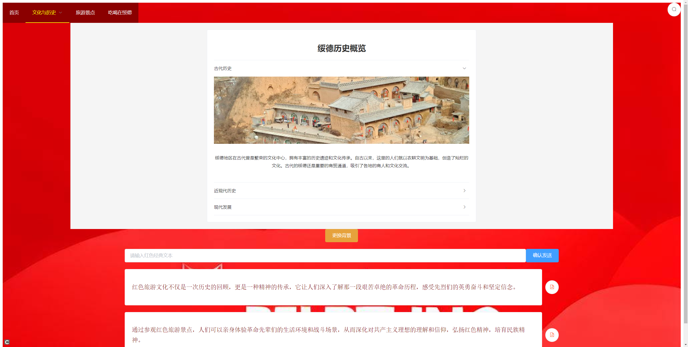
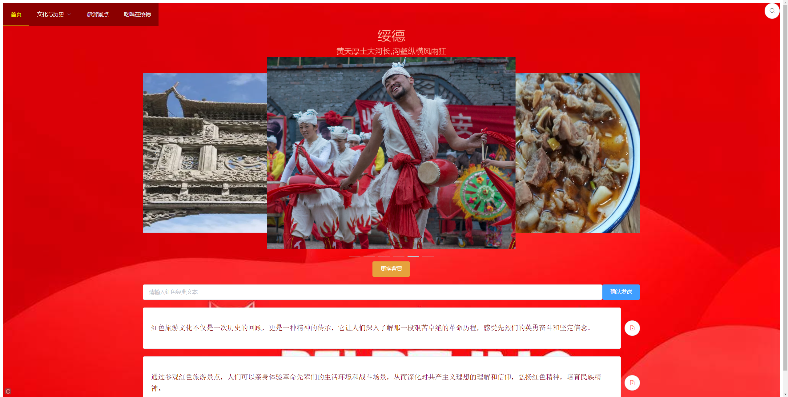

# 红色旅游项目

## 项目介绍

红色旅游项目是一个致力于推广和展示中国红色旅游文化的网站。通过这个项目，用户可以了解到中国各地的红色旅游景点、红色历史文化、红色经典语句等内容。项目采用了现代化的前端技术栈，结合精美的UI设计，为用户提供了丰富的视觉体验和便捷的操作流程。


### 页面展示





### 主要功能

- **景点展示**：详细介绍各个红色旅游景点的历史背景、文化意义和旅游指南。
- **历史文化**：深入挖掘红色历史文化，包括重要历史事件、人物、文献等。
- **用户互动**：用户可以提交红色经典语句，共同参与文化传承。

## 技术栈

- **Vue.js**：前端框架
- **Element UI**：UI组件库
- **LESS**：CSS预处理器
- **Webpack**：模块打包工具
- **Axios**：HTTP请求库
- **vuex**：状态管理单元

## 如何启动项目

### 环境要求

- Node.js v12.0.0 或更高版本
- npm v6.0.0 或更高版本

### 安装依赖

首先，克隆项目到本地，并进入项目目录：

```bash
git clone https://github.com/7BlackJack/red-tourism.git
cd red-tourism
```

然后，使用npm安装项目依赖：

```bash
npm install
```

### 启动开发服务器

使用以下命令启动开发服务器：

```bash
npm run serve
```

现在，你可以在浏览器中访问 `http://localhost:8080` 来查看项目。

### 构建生产版本

要构建生产版本，请运行：

```bash
npm run build
```

构建完成后，`dist`目录下将包含生产版本的文件。

## 贡献与支持

如果你对项目有任何建议或想要贡献代码，请通过GitHub提交Issue或Pull Request。

## 许可证

本项目采用MIT许可证，详情请见[LICENSE](LICENSE)文件。

---

这个 `Readme.md`文件提供了项目的详细介绍、技术栈、启动和构建指南等信息，有助于其他开发者了解和参与项目。
